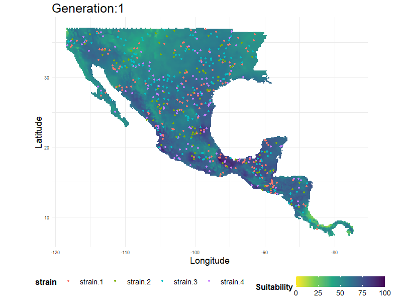

# vesstosim  
A set of functions to simulate disease spread.  Intended for visualization and educational purposes only.  

See the [Demo Vignette](https://github.com/geoepi/vesstosim/blob/main/vignettes/Demo.md) for a brief overview.  
    
    
