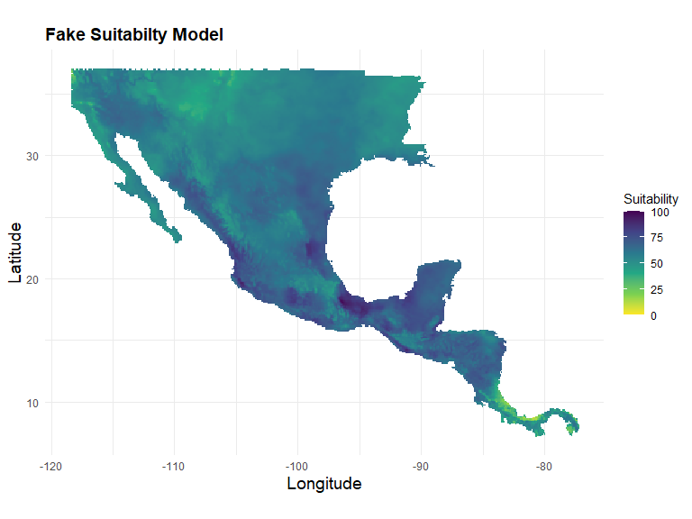

Simulated Disease Spread
================

- <a href="#libraries" id="toc-libraries">Libraries</a>
- <a href="#load-example-raster" id="toc-load-example-raster">Load Example
  Raster</a>
- <a href="#prepare-raster" id="toc-prepare-raster">Prepare Raster</a>
- <a href="#main-function" id="toc-main-function">Main Function</a>
- <a href="#simulate-multiple-generations"
  id="toc-simulate-multiple-generations">Simulate Multiple Generations</a>
- <a href="#animated-generation-series"
  id="toc-animated-generation-series">Animated Generation Series</a>
- <a href="#stepwise-demo-of-functions"
  id="toc-stepwise-demo-of-functions">Stepwise Demo of Functions</a>

## Libraries

<details open>
<summary>Hide code</summary>

``` r
library(tidyverse)
library(gganimate)
library(raster)
library(terra)
library(raptr)
library(here)
```

</details>

Load **vesstosim** functions:

<details open>
<summary>Hide code</summary>

``` r
library(vesstosim)
```

</details>

## Load Example Raster

This is a stack with 16 temperature layers derived from MIROC6
(https://wcrp-cmip.org/nodes/miroc/).

<details open>
<summary>Hide code</summary>

``` r
test_r <- rast(here("assets/MIROC6_012222.tif"))[[1]]
test_r
```

</details>

    class       : SpatRaster 
    dimensions  : 450, 900, 1  (nrow, ncol, nlyr)
    resolution  : 4.783622, 7.321982  (x, y)
    extent      : -2041.554, 2263.706, -3114.816, 180.0761  (xmin, xmax, ymin, ymax)
    coord. ref. : +proj=aea +lat_0=37.5 +lon_0=-96 +lat_1=29.5 +lat_2=45.5 +x_0=0 +y_0=0 +datum=NAD83 +units=km +no_defs 
    source      : MIROC6_012222.tif 
    name        : MIROC6_012222_1 
    min value   :       -3.635353 
    max value   :        2.123827 

## Prepare Raster

This function strips the geographic projection and optionally scales
values to the 0-100 range required for other functions. This example
raster has a Mercator projection and negative cell values, so it needs
some preprocessing.

<details open>
<summary>Hide code</summary>

``` r
test_r <- prep_raster(test_r, scale=TRUE)
test_r <- aggregate(test_r, fact=2) # more coarse to speed up, more cell = more time
test_r
```

</details>

    class       : SpatRaster 
    dimensions  : 317, 477, 1  (nrow, ncol, nlyr)
    resolution  : 0.1029247, 0.1029247  (x, y)
    extent      : -119.3474, -70.25233, 6.473571, 39.10069  (xmin, xmax, ymin, ymax)
    coord. ref. : +proj=longlat +datum=WGS84 +no_defs 
    source(s)   : memory
    name        : MIROC6_012222_1 
    min value   :        6.819771 
    max value   :       99.825994 

### View Results

<details open>
<summary>Hide code</summary>

``` r
quick_plot <- plot_mappoints(test_r, plot.title = "Fake Suitabilty Model")
quick_plot
```

</details>



## Main Function

## Simulate Multiple Generations

Several generations are simulated, each dependent on the previous. May
take a couple minutes…

<details open>
<summary>Hide code</summary>

``` r
spread_sim <- simulate_generations(gen_n = 5,        # Number of generations to simulate 
                                   input_r = test_r,  # Environmental suitability raster
                                   n = 500,           # Initial population size
                                   strain_n = 4,      # number of strains to randomly assign
                                   mean_dis = 50,     # mean virus movement distance (km)
                                   R0 = c(1,3,2,5)    # Reproduction number, mean offspring
                                   )                  # can be unique R0 by strain


dim(spread_sim)
```

</details>

    [1] 47827     5

<details open>
<summary>Hide code</summary>

``` r
range(spread_sim$gen)
```

</details>

    [1] 1 5

<details open>
<summary>Hide code</summary>

``` r
spread_sim %>%
  group_by(strain) %>%
  summarise(Count = length(strain))
```

</details>

    # A tibble: 4 × 2
      strain   Count
      <chr>    <int>
    1 strain.1 43438
    2 strain.2  1871
    3 strain.3  2050
    4 strain.4   468

<details open>
<summary>Hide code</summary>

``` r
head(spread_sim)
```

</details>

      rand.id   strain       lat       long gen
    1     2.1 strain.4 26.167234 -108.18483   1
    2     3.1 strain.4 24.403230 -100.64308   1
    3     4.1 strain.4 35.373368  -95.67442   1
    4     5.1 strain.3  8.116103  -81.25172   1
    5     6.1 strain.3 30.214266  -99.54527   1
    6     6.1 strain.3 30.291729  -99.02963   1

## Animated Generation Series

<details open>
<summary>Hide code</summary>

``` r
animate_generations2(
  raster_layer = test_r, # suitability for map background
  point_data = spread_sim, # data simulated above
  output_file = "./assets/sim_generations.gif" # name for saved gif
)
```

</details>


## Stepwise Demo of Functions

### Generate Initial Virus Locations

Eventually, different strains could be assigned different virulence or
habitat/vector requirements.

<details open>
<summary>Hide code</summary>

``` r
initial_virus <- initial_generation(input_r = test_r, #climate raster for testing
                                    n = 1000,        #number to create
                                    strain_n = 4)    #random strain names


dim(initial_virus)
```

</details>

    [1] 1000    4

<details open>
<summary>Hide code</summary>

``` r
head(initial_virus)
```

</details>

           long      lat rand.id   strain
    1 -101.7987 26.80119       1 strain.3
    2 -104.4748 25.15440       2 strain.4
    3 -100.3578 27.41874       3 strain.4
    4 -102.5192 21.24326       4 strain.2
    5 -104.1660 36.68196       5 strain.4
    6 -112.0912 36.06441       6 strain.2

View Results  
Random assignment but weighted by suitabilty score.

<details open>
<summary>Hide code</summary>

``` r
quick_plot <- plot_mappoints(test_r, initial_virus, "Suitabilty and Initial Points")
quick_plot
```

</details>


### Create One New Generations

Movement distance (mean_dis) from source location and the number of
offspring produced (R0) are stochastic.

<details open>
<summary>Hide code</summary>

``` r
virus_spread <- generation_iterate(random_points = initial_virus,
                                   mean_dis = 50, #mean of a normal dist, stochastic distance
                                   R0 = 5, #mean of a poisson dist, stochastic offspring N
                                   input_raster = test_r #suitability grid
                                   )

dim(virus_spread)
```

</details>

    [1] 4612    4

<details open>
<summary>Hide code</summary>

``` r
head(virus_spread) # Note that the rand.id can be traced back to initial point of origin
```

</details>

      rand.id   strain      lat      long
    1     1.1 strain.3 26.84755 -101.2930
    2     1.1 strain.3 26.40179 -101.5687
    3     1.1 strain.3 26.45143 -102.1273
    4     1.1 strain.3 26.39365 -101.5541
    5     1.1 strain.3 27.16309 -101.4657
    6     1.1 strain.3 26.77150 -102.3040

View Results Offspring from initial virus locations.

<details open>
<summary>Hide code</summary>

``` r
quick_plot <- plot_mappoints(test_r, virus_spread, "1st Generation Offspring")
quick_plot
```

</details>


### Random Removal

Random extinction and removal. Probability of extinction is related to
environmental suitability but stochastic.

<details open>
<summary>Hide code</summary>

``` r
extant_virus <- virus_cull(input_r=test_r, points_df=virus_spread)

dim(extant_virus)
```

</details>

    [1] 2766    4

<details open>
<summary>Hide code</summary>

``` r
head(extant_virus)
```

</details>

      rand.id   strain      lat       long
    1     1.1 strain.3 26.84755 -101.29298
    2     1.1 strain.3 26.40179 -101.56865
    3     1.1 strain.3 27.16309 -101.46568
    4     1.1 strain.3 26.77150 -102.30396
    5     3.1 strain.4 27.52223  -99.88719
    6     3.1 strain.4 26.97166 -100.43862

View Results  
View first generation offspring after local extinction.

<details open>
<summary>Hide code</summary>

``` r
quick_plot <- plot_mappoints(test_r, extant_virus, "Random Extiction from 1st Generation")
quick_plot
```

</details>


### Simulate Multiple Generations

Several generations are simulated, each dependent on the previous. May
take a couple minutes…

<details open>
<summary>Hide code</summary>

``` r
spread_sim <- simulate_generations(gen_n = 5,        # Number of generations to simulate 
                                   input_r = test_r,  # Environmental suitability raster
                                   n = 500,           # Initial population size
                                   strain_n = 4,      # number of strains to randomly assign
                                   mean_dis = 50,     # mean virus movement distance (km)
                                   R0 = 3             # Reproduction number, mean offspring
                                   )


dim(spread_sim)
```

</details>

    [1] 20844     5

<details open>
<summary>Hide code</summary>

``` r
range(spread_sim$gen)
```

</details>

    [1] 1 5

<details open>
<summary>Hide code</summary>

``` r
head(spread_sim)
```

</details>

      rand.id   strain      lat       long gen
    1     1.1 strain.3 16.66342  -91.58108   1
    2     2.1 strain.1 26.88854 -102.59401   1
    3     2.1 strain.1 26.17508 -103.20174   1
    4     3.1 strain.1 28.01472  -97.95462   1
    5     3.1 strain.1 28.72546  -98.03157   1
    6     3.1 strain.1 28.11722  -97.85347   1

View Results  
Panel View of simulation.

<details open>
<summary>Hide code</summary>

``` r
quick_plot <- plot_generations(test_r, spread_sim, "Multiple Generations")
quick_plot
```

</details>


